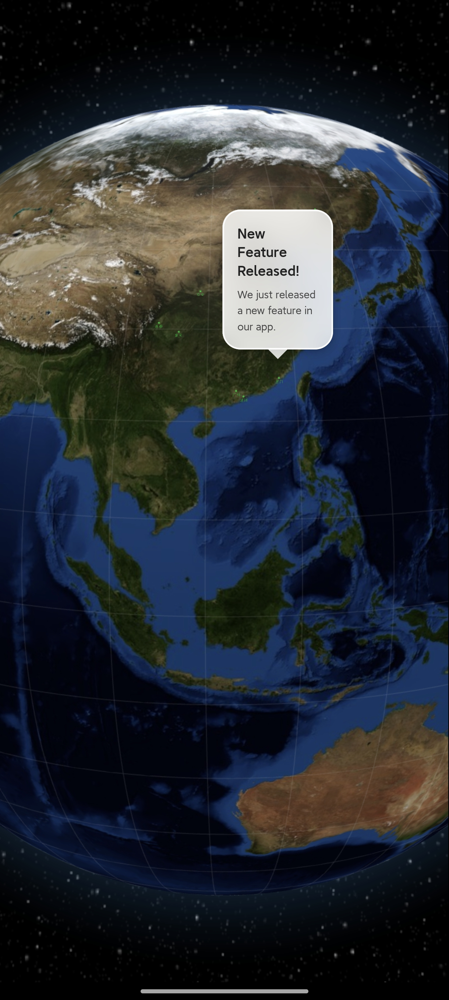

# Earth Explore

Earth Explore 是一个使用 **Three.js** 和 **Globe.gl** 构建的 3D 地球可视化项目，展示了互动的地球模型与标记信息，并且实时显示世界各地新闻事件的具体位置。

在线预览地址：[https://zhang-fulin.github.io/Earth-Explore](https://zhang-fulin.github.io/Earth-Explore)

此外，项目还开发了对应的移动应用版：
- App 仓库地址：[https://github.com/Zhang-fulin/Earth-Explore-App](https://github.com/Zhang-fulin/Earth-Explore-App)
- 基于 **Expo** 和 **React Native** 开发，通过 WebView 嵌入展示 Earth Explore 网站。

项目中的地球新闻数据来源于独立的数据处理仓库：
- 数据仓库地址：[https://github.com/Zhang-fulin/Earth-Explore-News](https://github.com/Zhang-fulin/Earth-Explore-News)
- 该仓库自动收集、摘要全球各地新闻数据，并同步到可视化项目中，标记在地球上对应的地理位置。

## 特性

- 🌍 3D 地球可视化
- 📌 新闻事件在地球上实时定位与展示
- 🚀 支持鼠标拖拽旋转、缩放浏览
- 🌟 基于 Three.js + Globe.gl 高性能渲染
- 🧩 响应式布局，适配不同屏幕尺寸
- 📱 移动端应用支持，兼容 Android / iOS
- 🗞️ 实时更新的全球新闻数据

## 使用方法

1. 克隆项目：

   ```bash
   git clone https://github.com/Zhang-fulin/Earth-Explore.git
   cd Earth-Explore
   ```

2. 安装依赖（如果有）：

   ```bash
   npm install
   ```

3. 本地运行：

   ```bash
   npm run start
   ```

4. 打包部署（GitHub Pages）：

   ```bash
   npm run deploy
   ```

## 部署

本项目已通过 GitHub Pages 自动部署到线上，源代码位于 `main` 分支，构建后的文件位于 `gh-pages` 分支。

## 预览截图



如果你喜欢这个项目，欢迎点个 Star ⭐！
